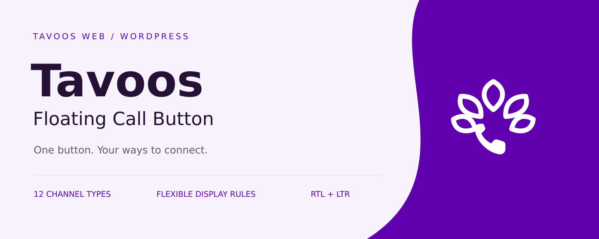
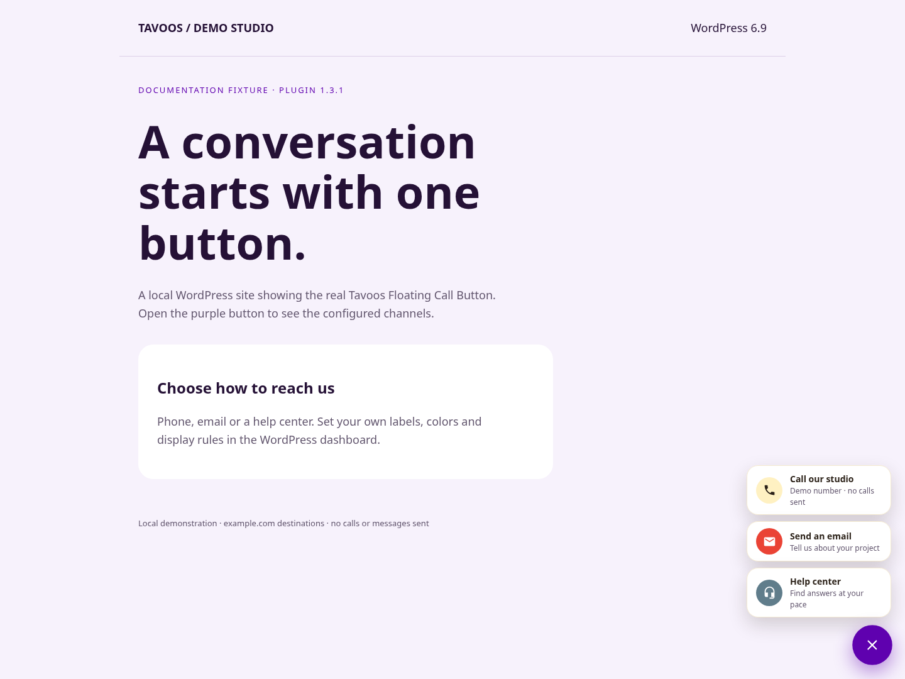
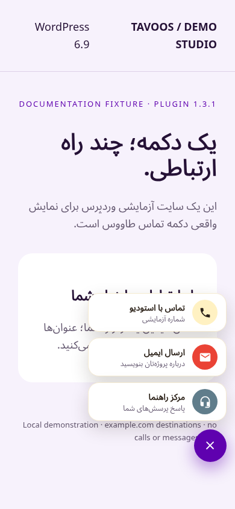

# Tavoos Floating Call Button · دکمه شناور تماس طاووس

**A floating contact menu for WordPress. Choose your channels, style the button, and decide where it appears.**

**یک دکمه شناور برای راه‌های ارتباطی سایت وردپرسی شما؛ با کانال‌ها، ظاهر و قواعد نمایش قابل تنظیم.**

[فارسی: آموزش تصویری](docs/guide-fa.md) · [English: illustrated guide](docs/guide-en.md) · [WordPress.org](https://wordpress.org/plugins/tavoos-floating-call-button/) · [Report an issue / گزارش مشکل](https://github.com/mmhdih/Tavoos-Floating-Call-Button/issues)

> Documentation targets **published 1.3.1**, source `cd6789f`. This branch updates the repository guide, brand assets and review-stage translations. It does not publish a new plugin version or change the reviewed 1.3.1 package.
>
> این راهنما برای **نسخه منتشرشده ۱.۳.۱** است. تغییرات این شاخه مربوط به مستندات، هویت بصری مخزن و فایل‌های ترجمه در مرحله بررسی است؛ نسخه جدیدی منتشر نمی‌کند و بسته تأییدشده ۱.۳.۱ را تغییر نمی‌دهد.

| What you can configure | امکانات |
| --- | --- |
| 12 channel types; add, disable, delete and drag to reorder | ۱۲ نوع کانال؛ افزودن، غیرفعال‌سازی، حذف و جابه‌جایی با کشیدن |
| Phone, WhatsApp, Telegram, Instagram, email, SMS, Eitaa, Bale, Rubika, LinkedIn, map and custom links | تماس، واتساپ، تلگرام، اینستاگرام، ایمیل، پیامک، ایتا، بله، روبیکا، لینکدین، نقشه و لینک دلخواه |
| 18 selectable icons, sanitized SVG code or an image | ۱۸ آیکون قابل انتخاب، کد SVG پاک‌سازی‌شده یا تصویر |
| Solid/gradient colors, menu colors, live admin preview | رنگ ثابت یا گرادیان، رنگ‌های منو و پیش‌نمایش زنده |
| Eight preset positions or percentage coordinates | هشت موقعیت آماده یا مختصات درصدی |
| Separate mobile size and offsets; configurable breakpoint | اندازه و فاصله مجزای موبایل و نقطه شکست قابل تنظیم |
| All pages, only selected pages, or exclusions | همه صفحات، فقط صفحات انتخاب‌شده یا نمایش به‌جز صفحات انتخاب‌شده |
| RTL/LTR, accessible button label, Escape to close, reduced-motion CSS | راست‌چین/چپ‌چین، برچسب دسترسی‌پذیری، بستن با Esc و رعایت کاهش حرکت |

 

The screenshots show the actual plugin on a disposable WordPress site. Purple is a configured example; the installed plugin’s default button remains gold. Demo destinations are not live support contacts. [Screenshot provenance and test results](docs/VALIDATION.md).

تصاویر از اجرای واقعی افزونه در یک وردپرس آزمایشی گرفته شده‌اند. بنفش تنظیم نمونه است؛ رنگ پیش‌فرض افزونه همچنان طلایی است. مقصدهای نمونه، اطلاعات تماس پشتیبانی واقعی نیستند. [جزئیات آزمون و تصاویر](docs/VALIDATION.md).

## Install / نصب

1. In **Plugins → Add New**, search **Tavoos Floating Call Button**, install and activate. Or upload the installable ZIP from [WordPress.org](https://wordpress.org/plugins/tavoos-floating-call-button/).
2. Open **Call Button** in the dashboard. Enter at least one enabled channel’s destination.
3. Press **Save settings**, then check a public page on desktop and mobile.

۱. در **افزونه‌ها ← افزودن**، نام **Tavoos Floating Call Button** را جست‌وجو، نصب و فعال کنید؛ یا فایل ZIP نصب را از [وردپرس](https://wordpress.org/plugins/tavoos-floating-call-button/) بارگذاری کنید.

۲. از منوی **دکمه تماس**، مقصد حداقل یک کانال فعال را وارد کنید.

۳. **ذخیره تنظیمات** را بزنید و نمایش سایت را در دسکتاپ و موبایل بررسی کنید.

**Requirements / نیازمندی‌ها:** WordPress 5.6+, PHP 7.2+ (declared minimums; this documentation fixture tested WordPress 6.9 / PHP 8.3). No API keys or messaging accounts are connected in the plugin. Links open the visitor’s browser/app; the plugin does not send messages itself.

حداقل اعلام‌شده وردپرس ۵.۶ و PHP ۷.۲ است؛ محیط این راهنما با وردپرس ۶.۹ و PHP ۸.۳ آزمایش شده است. افزونه به کلید API نیاز ندارد؛ لینک را در مرورگر یا برنامه بازدیدکننده باز می‌کند و خودش پیام ارسال نمی‌کند.

## Guides and project files / راهنما و فایل‌ها

- [Complete English tutorial](docs/guide-en.md) / [آموزش کامل فارسی](docs/guide-fa.md): all settings, channel formats, display rules, mobile, RTL, accessibility, upgrade, uninstall and troubleshooting.
- [Translation status / وضعیت ترجمه](translations/README.md): English source and Persian `fa_IR`; 151/151 catalog entries, with human review status stated explicitly.
- [Editable logo and banner / لوگو و بنر قابل ویرایش](docs/brand/README.md): original SVG and PNG artwork in `#5F01AF`.
- [Developer hooks / فیلترهای توسعه‌دهندگان](docs/developers.md) and [validation / آزمون‌ها](docs/VALIDATION.md).

**Limits:** no analytics, chat inbox, online/offline schedule, agent routing, message delivery or automatic translation of your saved content. Many channels or long labels may exceed the viewport; test the open menu on small screens. Accessibility support is not a WCAG certification.

**محدودیت‌ها:** آمار کلیک، صندوق گفتگو، برنامه زمانی آنلاین/آفلاین، توزیع پیام بین کارشناسان، ارسال پیام و ترجمه خودکار محتوای ذخیره‌شده وجود ندارد. تعداد زیاد کانال‌ها یا متن طولانی ممکن است از صفحه بیرون بزند؛ منوی باز را در موبایل بررسی کنید. امکانات دسترسی‌پذیری به معنی گواهی انطباق WCAG نیست.

Built by [Mahdi Habibi · Tavoos Web / مهدی حبیبی · طاووس وب](https://tavoosweb.ir/) · GPLv2 or later.
