# Illustrated guide · Tavoos 1.3.1

[README](../README.md) · [فارسی](guide-fa.md)

All screenshots in this guide come from the actual, unchanged 1.3.1 plugin running in a disposable WordPress 6.9 / PHP 8.3 fixture. The purple button, sample website and example.com contacts are configured demonstration content. Older screenshots outside `screenshots/1.3.1/` are retained historical assets, not this guide’s evidence.

## 1. Install and open settings

Use **Plugins → Add New** and search “Tavoos Floating Call Button”, or upload its installable ZIP from [WordPress.org](https://wordpress.org/plugins/tavoos-floating-call-button/). For manual installation, place the plugin files in `wp-content/plugins/tavoos-floating-call-button/`, then activate. A GitHub source ZIP includes development files and is not the recommended user install package.

Open **Call Button**, or click **Settings** in the Plugins list. Settings require an administrator with `manage_options`. The minimums declared by 1.3.1 are WordPress 5.6 and PHP 7.2; the current fixture does not test that entire compatibility range.

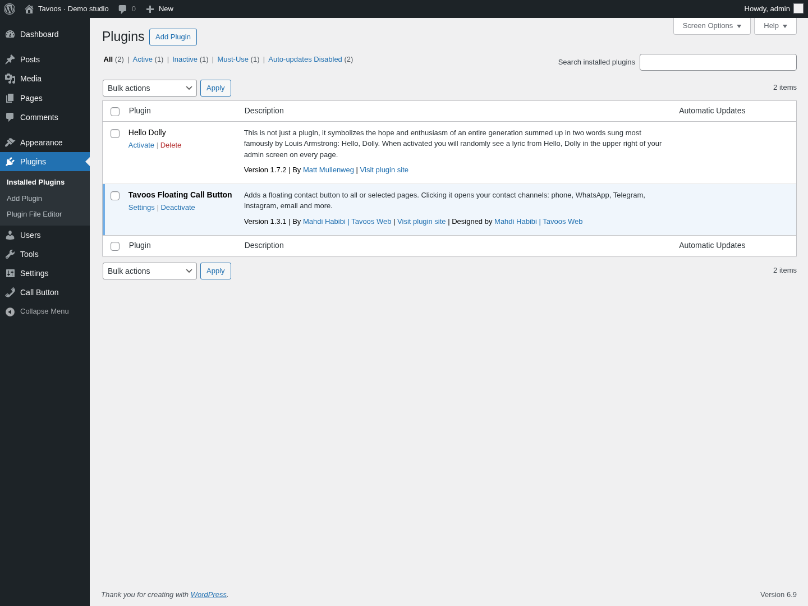

The initial phone and WhatsApp rows have empty destinations; Telegram is disabled. **Nothing appears on the public site until at least one enabled channel has a nonempty destination.**

## 2. Contact channels

In **Contact channels**, choose a type beside **Add a new channel**, then press **Add**. Expand a row by its title or arrow. Fill **Number / username / link**, **Title**, optional **Subtitle**, and the message/subject field when offered. Set **Open link in a new tab** as needed; native phone/email handlers still depend on the visitor’s device.

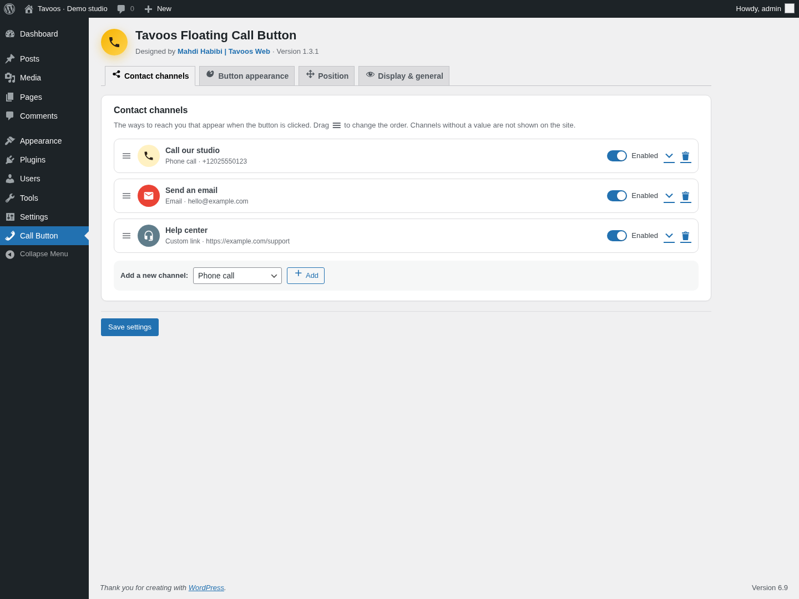

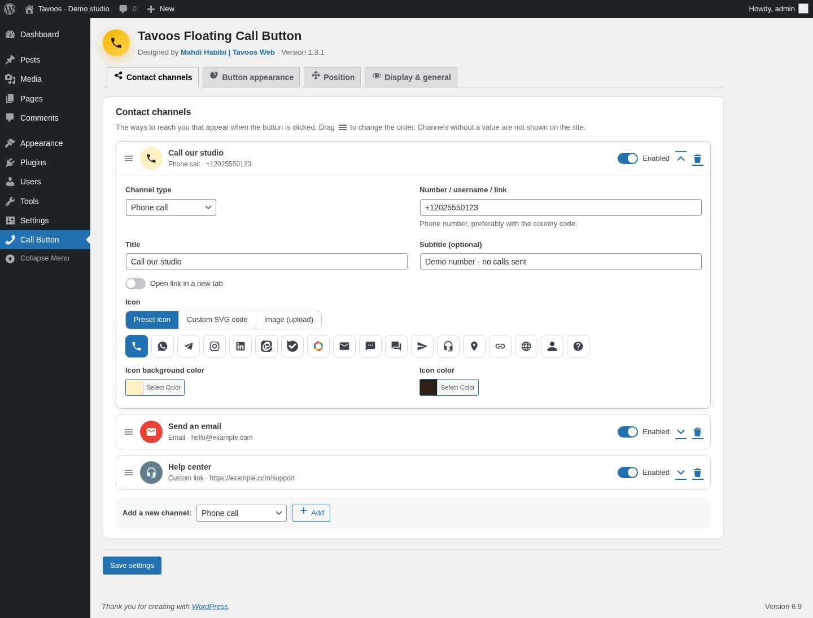

- **Enabled** hides a row without deleting it. Empty destinations are omitted from the public menu.
- Drag the handle to reorder. The trash button asks for confirmation before removal. Save to persist changes; a preview is not a saved configuration.
- Changing type updates its hint and icon/color defaults. Recheck the destination and title after changing type.
- There is no hardcoded channel count limit, but your screen height is a practical limit. Start with a short list.
- **Single channel** in Display & general bypasses the menu only when exactly one enabled, nonempty channel survives filtering.

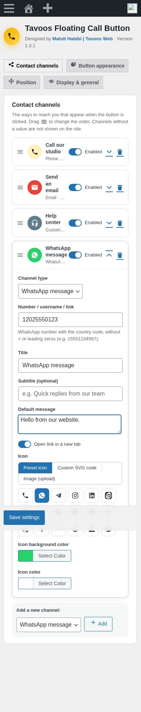

### Every built-in channel type

Examples below are illustrative; do not call or message them.

| Type | Enter | Built link / behavior |
| --- | --- | --- |
| Phone call | `+12025550123` | `tel:+12025550123`; strips non-number characters except `+` |
| WhatsApp message | `12025550123` | `https://wa.me/12025550123`; optional message uses URL-encoded `text` |
| Telegram | `example` or `@example` | `https://t.me/example` |
| Instagram | `example` | `https://instagram.com/example` |
| Email | `hello@example.com` | `mailto:hello@example.com`; optional subject uses `subject` |
| SMS | `+12025550123` | `sms:+12025550123`; optional body uses `body` |
| Eitaa | `example` | `https://eitaa.com/example` |
| Bale | `example` | `https://ble.ir/example` |
| Rubika | `example` | `https://rubika.ir/example` |
| LinkedIn | Full profile/company URL | Uses full URL; a bare username becomes `https://www.linkedin.com/in/username` |
| Address on map | Full map URL | Opens the chosen map service; no map embed or location lookup |
| Custom link | `https://example.com/support` | Uses your URL; without a scheme, prefixes `https://` |

Persian and Arabic digits are converted to Latin digits. Use international phone numbers: the plugin cannot infer your country code. WhatsApp removes a leading `00`, but does not fix a local number’s missing country code.

A value beginning with a URI scheme bypasses link building, **including automatic message/subject appending**. Include query parameters yourself when entering a full URL. Output is escaped using allowed WordPress protocols plus `tel`, `sms`, `mailto`, `tg`, `whatsapp`, `viber`, `skype`, `geo`, `intent`; arbitrary schemes are not guaranteed. App installation, browser policy and service availability determine whether a link works. No message is sent automatically.

## 3. Icons, images and SVG

The main button and each channel have the same three icon sources:

| Source | How to use |
| --- | --- |
| Preset icon | Choose from 18 visible choices: Phone, WhatsApp, Telegram, Instagram, LinkedIn, Eitaa, Bale, Rubika, Email, SMS, Chat, Send, Support, Location/map, Link, Website, User/agent, Question. The internal Close icon is not a picker choice. |
| Custom SVG code | Paste the complete `<svg>…</svg>`. Use `fill="currentColor"` to follow Icon color. The plugin allowlists SVG elements/attributes; scripts/events are removed, and unsupported SVG features may disappear. |
| Image (upload) | Enter an image URL or press **Choose from Media Library**, select/upload an allowed image and press **Use as icon**. A transparent PNG or WebP is a practical choice. |

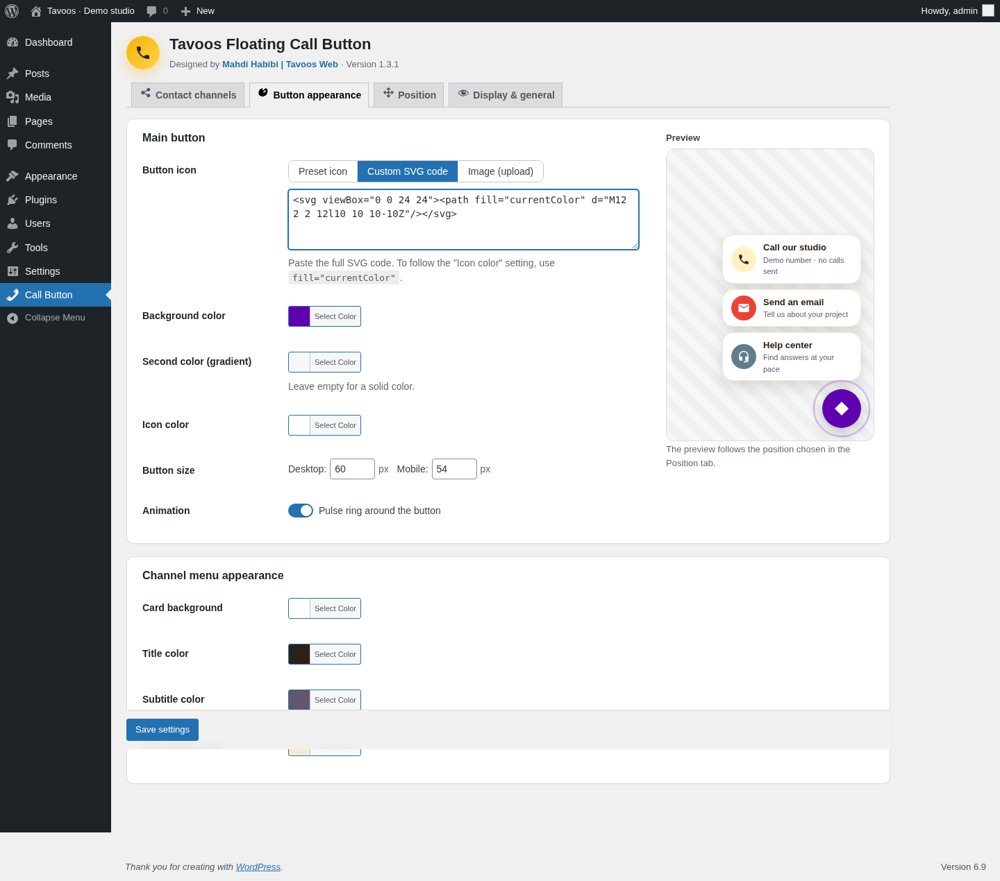

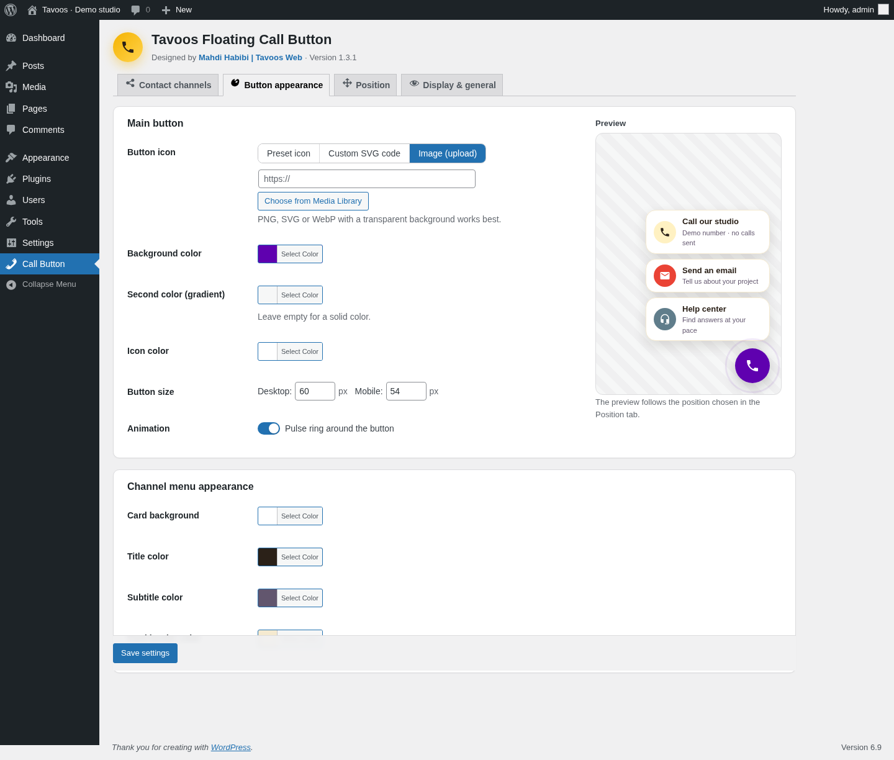

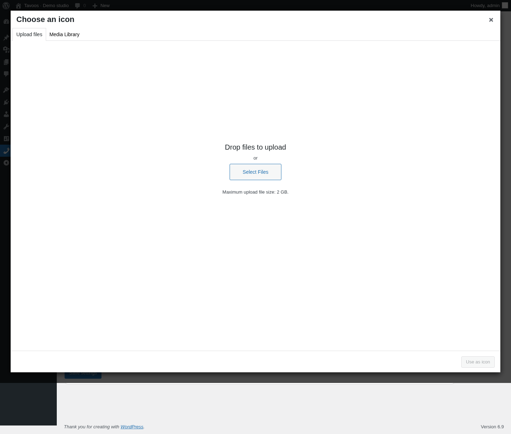

The plugin does not enable SVG file uploads that WordPress rejects. The SVG *code* field is separate from uploading an SVG *file*. Image colors and the multicolor Rubika preset do not follow a single icon-color override. Keep images lightweight; third-party image URLs cause visitor requests to their hosts.

## 4. Button and menu appearance

In **Button appearance**, set the main icon, **Background color**, optional **Second color (gradient)** and **Icon color**. Leave the second color empty for a solid fill. The desktop/mobile button sizes accept 30–150 px; defaults are 60/54 px. Prefer at least 44 px for a usable touch target.

Toggle **Pulse ring around the button**. The frontend CSS disables animation and transitions when the visitor requests reduced motion. Under **Channel menu appearance**, set card background, title, subtitle and border colors. Each channel’s icon background and icon color remain independent.

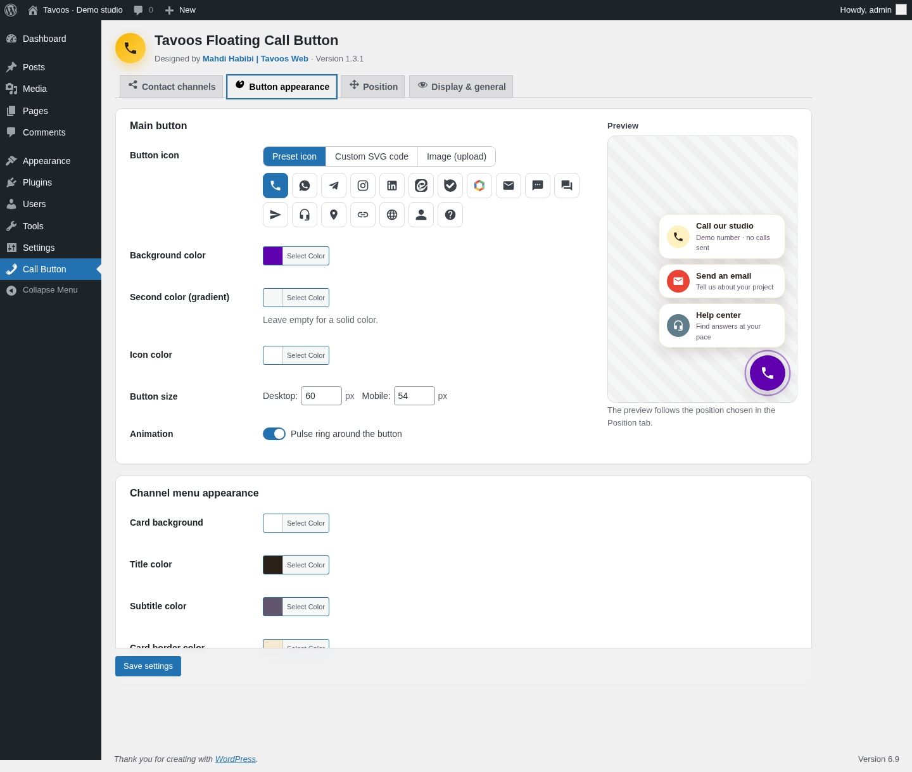

The live preview reflects edits and the selected position but is not a substitute for the public page. The screenshots use purple `#5F01AF`, white icons and darker subtitle text; these are examples, not changed plugin defaults. Check contrast after every palette change.

## 5. Position and mobile

Select bottom right/left/center, middle right/left, or top right/left/center. Set desktop and mobile horizontal/vertical edge distances (0–500 px). Increase mobile vertical distance to clear sticky footers. A centered position uses the center axis instead of the horizontal edge offset.

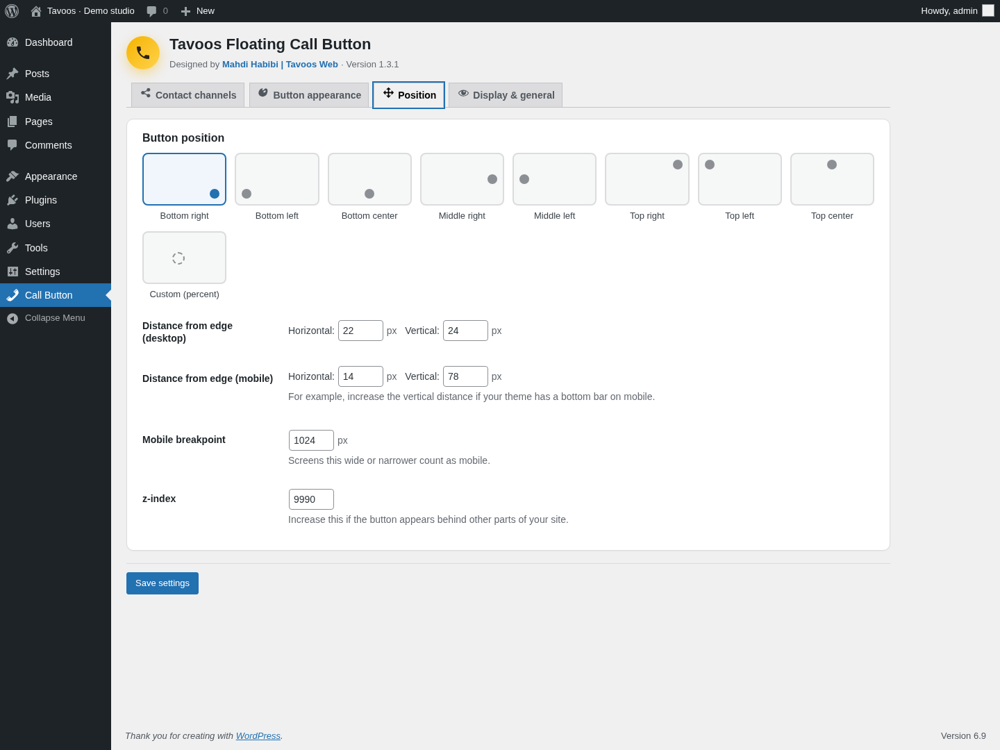

Choose **Custom (percent)** to click/drag the point or enter W/H numerically. W is measured from the left; H from the top. Both accept 0–100%. The button stays inside the viewport through percentage translation; the same coordinates apply on mobile. Edge-distance controls do not apply to this mode.

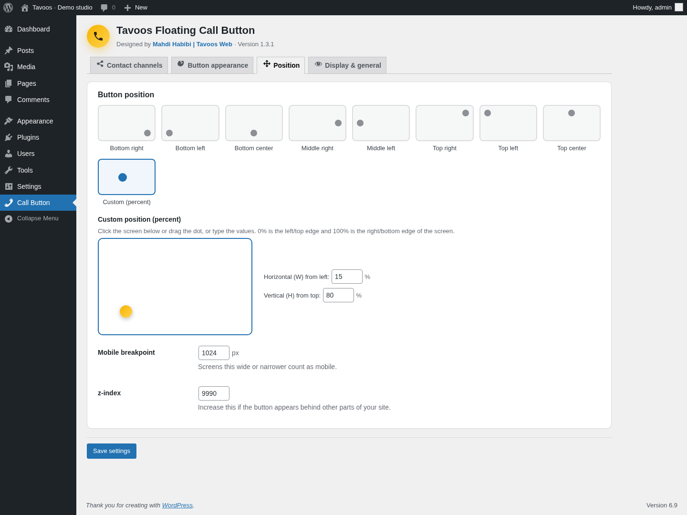

The menu opens up/down or sideways based on position. This is a fixed placement rule, not full collision detection: a long menu or a custom position can still overflow. **Mobile breakpoint** defaults to 1024 px: this width and below use mobile settings; above it use desktop. Zero makes every width count as desktop. These are viewport rules, not device detection. **z-index** defaults to 9990; adjust only if other elements obscure the button.

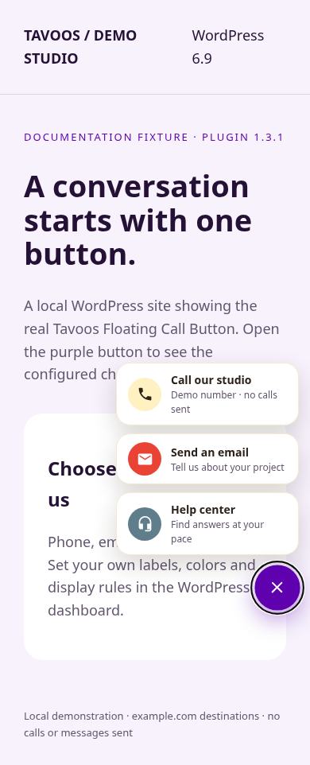

## 6. Display rules and general settings

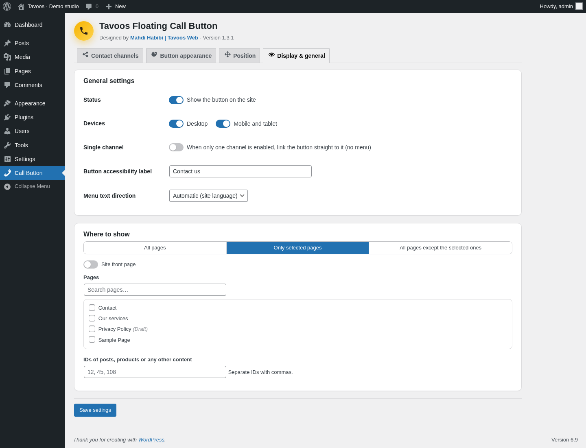

- **Status** enables/disables the entire button.
- **Devices** independently enables desktop and mobile/tablet widths.
- **Single channel** chooses direct-link mode as described above.
- **Button accessibility label** names the menu toggle. Direct-link mode uses the channel title when available.
- **Menu text direction** is automatic from WordPress RTL status, or forced RTL/LTR. It does not translate your text.

| Where to show | Result |
| --- | --- |
| All pages | All public pages where the theme prints `wp_footer()` and the plugin is enabled |
| Only selected pages | Only matching front page / page / content ID; no selections means no matches |
| All pages except the selected ones | Every eligible page except matches; no selections excludes nothing |

Check **Site front page**, search and select **Pages**, or enter comma-separated post/product/content IDs. IDs appear in edit URLs such as `post=123`; Persian/Arabic digits and Persian commas are supported. The selected front page, singular content, separate posts page and WooCommerce shop page have explicit matching support in the code. Product IDs target individual products, not all product archives. Category/tag/date/search archives have no dedicated selector. Custom rules require the developer filter; see [hooks](developers.md). WooCommerce behavior was code-reviewed, not exercised in this fixture.

**Save settings** before opening the public site. Page restrictions prevent frontend assets loading on excluded pages. Device switches hide through CSS; they are not server-side privacy or access controls.

## 7. Persian, RTL and keyboard access

English is the source language. The repository includes a complete Persian catalog for review and local testing; automatic WordPress.org language-pack availability is not assumed. Follow [translation installation/status](../translations/README.md). Saved titles, subtitles, messages and accessibility labels need manual translation. A user's dashboard language can differ from the site language.

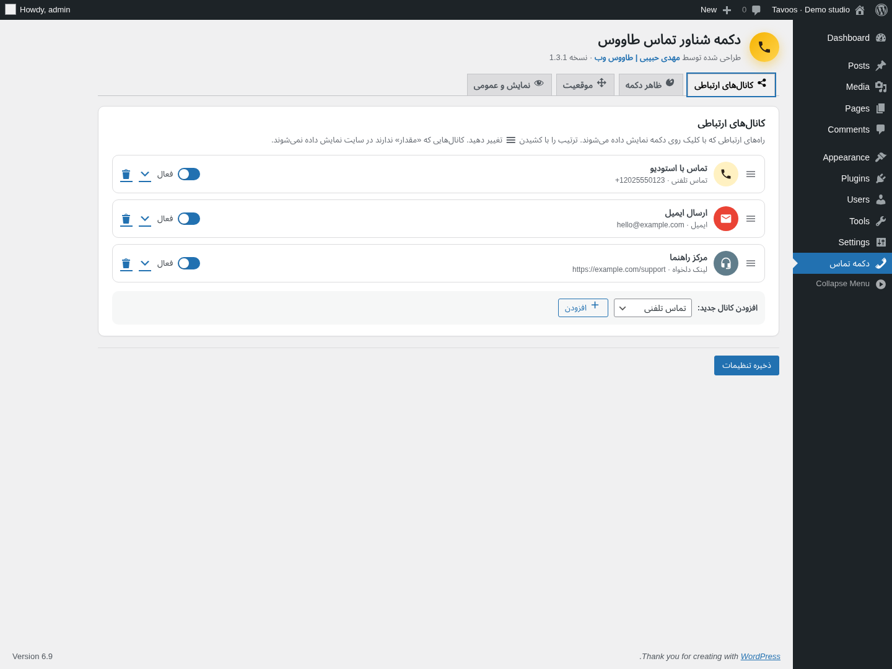

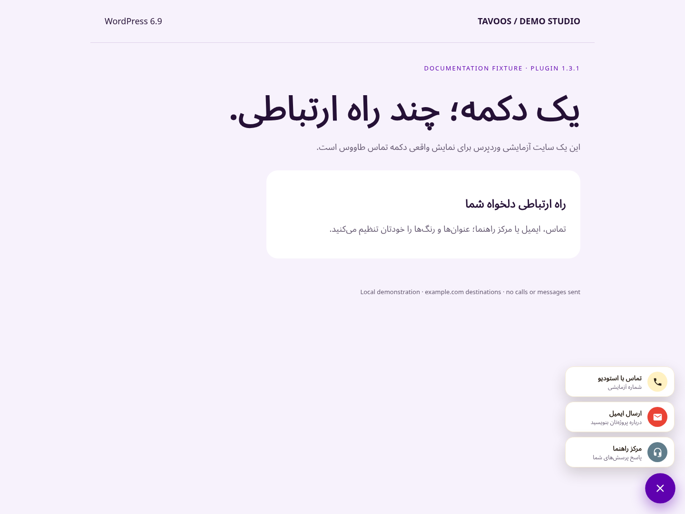

The frontend toggle uses `aria-label`, `aria-expanded`, `aria-controls` and a hidden menu. Activate it with Enter/Space; Escape closes and returns focus to the toggle. Clicking outside closes it. The channel links precede the toggle in DOM order: use Shift+Tab from the open toggle to reach them; focus is not automatically moved into the menu. It is not a dialog and does not trap focus. Admin channel reordering is drag-based, with no dedicated keyboard reorder control. Test keyboard navigation, contrast, zoom and screen readers on your own theme; these features are not a WCAG conformance claim.

## 8. Upgrade, deactivate and uninstall

Back up the database/settings before upgrading. For an ordinary 1.3.x update, use WordPress’s update flow and check your destinations and display rules afterward. Deactivation keeps settings; **Delete removes `tavoos_fcb_options`**. There is no built-in export/import or recycle bin.

For 1.2 or older (“Floating Call Button”), install the new slug `tavoos-floating-call-button`. If both copies are active, the new copy can pause with a notice. **Deactivate the older copy, open the new plugin’s settings, verify migrated channels and rules, test the public button, and only then delete the older copy.** Do not delete first. Migration prefers `tavoos_fcb_settings` over `fcb_settings`, copies to `tavoos_fcb_options`, and removes migrated legacy options. Earlier custom code using `fcb_*` filters must use `tavoos_fcb_*` names. Multisite/network migration was not tested here.

## 9. Troubleshooting and genuine limits

| Symptom | Check |
| --- | --- |
| No button | Save; enable Status; enter a destination in an enabled channel; check device widths and include/exclude rules; clear page cache; confirm the theme calls `wp_footer()`. |
| Preview changed, public site did not | Save settings; clear page/CDN cache and confirm you are viewing the expected page. |
| Phone/SMS/email does not open | Check destination and country code; ensure the device has a handler. Desktop browsers may not support phone/SMS. SMS prefill support varies. |
| Prefilled message missing | A full URL bypasses the message builder. Use a bare number or supply your own encoded query string. |
| Icon missing or wrong color | Check image URL and mixed-content restrictions; upload an allowed file; simplify SVG; use `currentColor`. Raster and multicolor icons retain their own colors. |
| Button covers sticky navigation | Increase mobile vertical distance or choose another position; test the open menu too. |
| Menu cut off | Reduce channel count/label length or use a corner position; no scrolling/collision-avoidance setting exists. |
| Interface stays English | Check site/user locale, language file path and domain; see the translation guide. Core/theme translations are separate. |
| Two plugin copies or paused notice | Follow the migration order above and verify before deleting old data. |

No click analytics, inbox, chatbot, agent assignment, business-hours schedule, automatic language switcher, remote messaging API or guaranteed delivery is implemented. The plugin itself does not need API credentials. A click navigates to a third-party service or a device handler; their terms/availability apply. Frontend code has no jQuery dependency; the WordPress admin uses jQuery and WordPress UI libraries. External icon images can make network requests.

For a reproducible bug, [open an issue](https://github.com/mmhdih/Tavoos-Floating-Call-Button/issues) with plugin/WordPress/PHP versions, theme, viewport, display mode and steps. Replace real phone numbers, email addresses and private URLs with examples. See [what was actually tested](VALIDATION.md).
