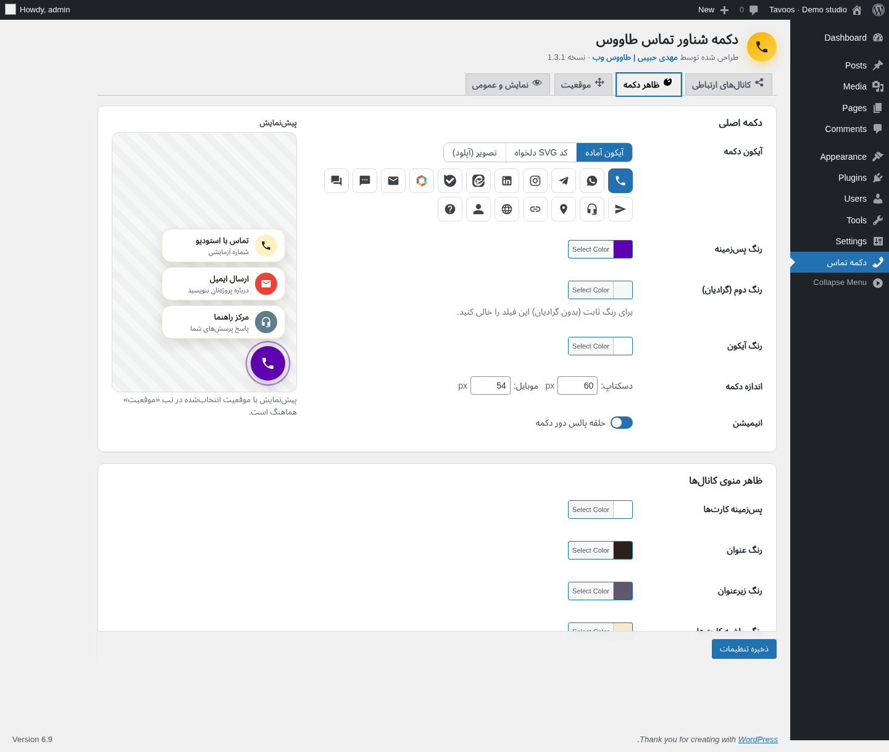
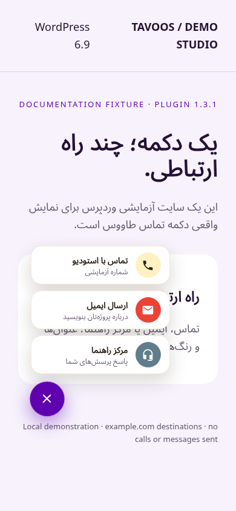

# آموزش تصویری دکمه شناور تماس طاووس · نسخه ۱.۳.۱

[صفحه اصلی](../README.md) · [English](guide-en.md)

تصاویر این راهنما از اجرای واقعی افزونه بدون تغییر کد در وردپرس آزمایشی ۶.۹ و PHP ۸.۳ تهیه شده‌اند. رنگ بنفش، سایت نمونه و مقصدهای example.com تنظیمات آزمایشی هستند؛ رنگ پیش‌فرض افزونه طلایی است. تصاویر قدیمی خارج از پوشه `screenshots/1.3.1/` برای سابقه حفظ شده‌اند و مبنای این راهنما نیستند.

## ۱. نصب و ورود به تنظیمات

در **افزونه‌ها ← افزودن**، عبارت **Tavoos Floating Call Button** را جست‌وجو، نصب و فعال کنید. راه دیگر، دریافت ZIP قابل نصب از [وردپرس](https://wordpress.org/plugins/tavoos-floating-call-button/) و بارگذاری آن است. در نصب دستی، فایل‌ها را در `wp-content/plugins/tavoos-floating-call-button/` قرار دهید و افزونه را فعال کنید. ZIP سورس گیت‌هاب شامل فایل‌های توسعه است و بسته پیشنهادی نصب کاربر نیست.

از منوی **دکمه تماس** یا پیوند **تنظیمات** در فهرست افزونه‌ها وارد شوید. تغییر تنظیمات به دسترسی مدیر با قابلیت `manage_options` نیاز دارد. حداقل اعلام‌شده وردپرس ۵.۶ و PHP ۷.۲ است؛ محیط این راهنما تمام این بازه سازگاری را آزمایش نکرده است.

در نصب اولیه، مقدار تماس و واتساپ خالی و تلگرام غیرفعال است. **تا وقتی حداقل یک کانال فعال با مقصد غیرخالی نداشته باشید، دکمه‌ای در سایت نمایش داده نمی‌شود.**

## ۲. کانال‌های ارتباطی

در تب **کانال‌های ارتباطی**، کنار **افزودن کانال جدید** نوع را انتخاب و **افزودن** را بزنید. روی عنوان یا فلش هر ردیف کلیک کنید تا باز شود. **شماره / نام کاربری / لینک**، **عنوان**، **زیرعنوان اختیاری** و متن پیام یا موضوع ایمیل را در صورت وجود وارد کنید. **باز شدن لینک در تب جدید** را به دلخواه تنظیم کنید؛ باز شدن برنامه تلفن یا ایمیل همچنان به دستگاه بازدیدکننده بستگی دارد.

- کلید **فعال** کانال را موقتاً پنهان می‌کند؛ مقدار خالی نیز باعث حذف آن از منوی سایت می‌شود.
- دستگیره را بکشید تا ترتیب تغییر کند. سطل زباله بعد از تأیید، ردیف را حذف می‌کند. تغییرات فقط با **ذخیره تنظیمات** ماندگار می‌شوند.
- تغییر نوع کانال، راهنما و پیش‌فرض آیکون و رنگ را به‌روز می‌کند؛ مقصد و عنوان را دوباره بررسی کنید.
- محدودیت عددی ثابتی برای تعداد کانال‌ها در کد وجود ندارد، اما ارتفاع صفحه محدود است. فهرست کوتاه انتخاب کنید.
- گزینه **یک کانال** در تب نمایش و عمومی فقط وقتی منو را حذف می‌کند که دقیقاً یک کانال فعال با مقصد غیرخالی باقی مانده باشد.

### راهنمای همه ۱۲ نوع کانال

این مقدارها فقط نمونه‌اند؛ با آن‌ها تماس نگیرید یا پیام نفرستید.

| نوع | مقدار نمونه | نتیجه |
| --- | --- | --- |
| تماس تلفنی | `+12025550123` | `tel:+12025550123`؛ نویسه‌های غیرعددی به‌جز `+` حذف می‌شوند |
| واتساپ | `12025550123` | `https://wa.me/12025550123`؛ پیام اختیاری در پارامتر `text` کدگذاری می‌شود |
| تلگرام | `example` یا `@example` | `https://t.me/example` |
| اینستاگرام | `example` | `https://instagram.com/example` |
| ایمیل | `hello@example.com` | `mailto:hello@example.com`؛ موضوع اختیاری با `subject` |
| پیامک | `+12025550123` | `sms:+12025550123`؛ متن اختیاری با `body` |
| ایتا | `example` | `https://eitaa.com/example` |
| بله | `example` | `https://ble.ir/example` |
| روبیکا | `example` | `https://rubika.ir/example` |
| لینکدین | لینک کامل شخص یا شرکت | لینک کامل بدون تغییر؛ نام کاربری تنها به `https://www.linkedin.com/in/username` تبدیل می‌شود |
| آدرس روی نقشه | لینک کامل سرویس نقشه | سرویس نقشه باز می‌شود؛ نقشه داخلی یا یافتن خودکار موقعیت ندارد |
| لینک دلخواه | `https://example.com/support` | لینک شما؛ در نبود پروتکل، `https://` به ابتدا افزوده می‌شود |

ارقام فارسی و عربی به لاتین تبدیل می‌شوند. شماره را با کد کشور وارد کنید؛ افزونه کشور را تشخیص نمی‌دهد. واتساپ `00` ابتدای شماره را حذف می‌کند، اما شماره محلی بدون کد کشور را اصلاح نمی‌کند.

وقتی مقدار با پروتکل شروع شود، ساخت خودکار لینک دور زده می‌شود؛ **متن پیام و موضوع ایمیل نیز خودکار به لینک کامل اضافه نمی‌شوند.** پارامترها را خودتان در لینک کامل قرار دهید. خروجی با پروتکل‌های مجاز وردپرس و `tel`، `sms`، `mailto`، `tg`، `whatsapp`، `viber`، `skype`، `geo` و `intent` پاک‌سازی می‌شود؛ هر پروتکل دلخواهی الزاماً مجاز نیست. باز شدن مقصد به مرورگر، برنامه نصب‌شده و دسترس‌پذیری سرویس بستگی دارد. افزونه خودش پیام ارسال نمی‌کند.

## ۳. آیکون آماده، SVG و تصویر

دکمه اصلی و هر کانال سه منبع آیکون دارند:

| روش | کاربرد |
| --- | --- |
| آیکون آماده | ۱۸ انتخاب: تلفن، واتساپ، تلگرام، اینستاگرام، لینکدین، ایتا، بله، روبیکا، ایمیل، پیامک، گفتگو، ارسال، پشتیبانی، نقشه، لینک، وب‌سایت، کاربر/کارشناس و سؤال. آیکون داخلی «بستن» در انتخاب‌گر نیست. |
| کد SVG دلخواه | کد کامل `<svg>…</svg>` را وارد کنید. برای پیروی از رنگ آیکون، `fill="currentColor"` بگذارید. تگ‌ها و ویژگی‌ها فهرست مجاز دارند؛ اسکریپت و رویداد حذف می‌شوند و ممکن است امکانات پیچیده SVG باقی نمانند. |
| تصویر | نشانی تصویر را وارد کنید یا **انتخاب از کتابخانه رسانه** را بزنید، تصویر مجاز را انتخاب/بارگذاری و **استفاده به عنوان آیکون** را تأیید کنید. PNG یا WebP شفاف مناسب است. |

افزونه محدودیت بارگذاری فایل SVG در وردپرس را رفع نمی‌کند. وارد کردن **کد SVG** با آپلود **فایل SVG** متفاوت است. رنگ تصویر و آیکون چندرنگ روبیکا با یک گزینه رنگ آیکون عوض نمی‌شود. تصویر کم‌حجم انتخاب کنید؛ نشانی تصویر خارجی باعث درخواست مرورگر بازدیدکننده به همان میزبان می‌شود.

## ۴. ظاهر دکمه و منو

در **ظاهر دکمه**، آیکون اصلی، **رنگ پس‌زمینه**، **رنگ دوم گرادیان** و **رنگ آیکون** را تنظیم کنید. رنگ دوم خالی یعنی رنگ ثابت. اندازه دسکتاپ و موبایل بین ۳۰ تا ۱۵۰ پیکسل است؛ پیش‌فرض‌ها ۶۰ و ۵۴ هستند. برای لمس راحت، اندازه حداقل ۴۴ پیکسل را ترجیح دهید.

**حلقه پالس دور دکمه** را روشن یا خاموش کنید. استایل سایت درخواست کاهش حرکت سیستم کاربر را رعایت می‌کند. در **ظاهر منوی کانال‌ها**، رنگ پس‌زمینه کارت، عنوان، زیرعنوان و حاشیه را تنظیم کنید. رنگ پس‌زمینه و رنگ آیکون هر کانال مستقل است.

پیش‌نمایش زنده تنظیمات و موقعیت را نشان می‌دهد، اما جای آزمایش صفحه واقعی را نمی‌گیرد. نمونه این راهنما بنفش `#5F01AF` با آیکون سفید و زیرعنوان تیره‌تر است؛ پیش‌فرض افزونه تغییر نکرده است. خوانایی و تضاد رنگ‌ها را بررسی کنید.

## ۵. موقعیت و موبایل

هشت موقعیت آماده شامل پایین راست/چپ/وسط، وسط راست/چپ و بالا راست/چپ/وسط است. فاصله افقی و عمودی برای دسکتاپ و موبایل جداگانه بین ۰ تا ۵۰۰ پیکسل تنظیم می‌شود. برای نوار ثابت پایین موبایل، فاصله عمودی را بیشتر کنید. در موقعیت وسط، فاصله افقی لبه کاربردی ندارد.

در **دلخواه (درصدی)**، نقطه را روی نمونه جابه‌جا کنید یا W/H را عددی وارد کنید. W از چپ و H از بالا اندازه‌گیری می‌شود؛ بازه هر دو ۰ تا ۱۰۰٪ است. خود دکمه با جابه‌جایی درصدی داخل صفحه می‌ماند. همین مختصات در موبایل استفاده می‌شود و فاصله‌های لبه در این حالت کاربرد ندارند.

جهت باز شدن منو طبق موقعیت تعیین می‌شود، نه با تشخیص کامل برخورد با لبه‌ها؛ منوی طولانی یا موقعیت نامناسب می‌تواند از صفحه بیرون بزند. **نقطه شکست موبایل** پیش‌فرض ۱۰۲۴ پیکسل است: عرض مساوی یا کمتر، موبایل و بالاتر، دسکتاپ محسوب می‌شود. صفر یعنی همه عرض‌ها دسکتاپ هستند. این قاعده عرض مرورگر است، نه تشخیص نوع دستگاه. **z-index** پیش‌فرض ۹۹۹۰ است؛ اگر دکمه زیر عناصر دیگر قرار می‌گیرد، آن را بررسی کنید.

## ۶. نمایش و تنظیمات عمومی

- **وضعیت:** فعال یا غیرفعال کردن کل دکمه.
- **دستگاه‌ها:** نمایش مستقل برای عرض دسکتاپ و موبایل/تبلت.
- **یک کانال:** رفتن مستقیم به لینک تنها کانال معتبر، بدون منو.
- **متن دسترسی‌پذیری:** نام دکمه برای فناوری کمکی؛ در حالت لینک مستقیم، عنوان کانال در صورت وجود استفاده می‌شود.
- **جهت متن منو:** خودکار بر اساس راست‌چین بودن وردپرس، یا راست‌چین/چپ‌چین اجباری. این گزینه متن‌ها را ترجمه نمی‌کند.

| حالت نمایش | نتیجه |
| --- | --- |
| همه صفحات | صفحات عمومی واجد شرایط که قالب آن‌ها `wp_footer()` دارد |
| فقط صفحات انتخاب‌شده | فقط صفحه اصلی، برگه یا شناسه محتوای منطبق؛ انتخاب خالی یعنی هیچ صفحه‌ای |
| همه به‌جز انتخاب‌شده‌ها | تمام صفحات واجد شرایط به‌جز موارد منطبق؛ انتخاب خالی چیزی را مستثنا نمی‌کند |

**صفحه اصلی سایت** را علامت بزنید، **برگه‌ها** را جست‌وجو و انتخاب کنید یا شناسه نوشته، محصول و محتوای دیگر را با کاما وارد کنید. شناسه در نشانی ویرایش مثل `post=123` دیده می‌شود؛ ارقام و ویرگول فارسی هم پشتیبانی می‌شوند. کد برای صفحه اصلی، محتوای تکی، صفحه جداگانه نوشته‌ها و صفحه فروشگاه ووکامرس منطق تطبیق دارد. شناسه محصول فقط همان محصول را هدف می‌گیرد، نه همه آرشیو محصولات. دسته، برچسب، تاریخ و جست‌وجو انتخاب‌گر اختصاصی ندارند؛ قواعد بیشتر به [فیلتر توسعه‌دهنده](developers.md) نیاز دارند. رفتار ووکامرس در این محیط فقط از کد بررسی شده است.

پیش از بازدید سایت **ذخیره تنظیمات** را بزنید. در صفحه‌های خارج از قواعد نمایش، فایل‌های سایت افزونه بارگذاری نمی‌شوند. مخفی‌سازی دستگاه با CSS انجام می‌شود و کنترل دسترسی یا حریم خصوصی سمت سرور نیست.

## ۷. ترجمه، راست‌چین و دسترسی‌پذیری

زبان اصلی افزونه انگلیسی و کاتالوگ فارسی مخزن برای بررسی و آزمایش کامل است. نصب خودکار بسته زبان از وردپرس را قطعی فرض نکنید؛ [راهنمای ترجمه](../translations/README.md) مسیر نصب و وضعیت بررسی را توضیح می‌دهد. عنوان، زیرعنوان، پیام و برچسب ذخیره‌شده را خودتان ترجمه کنید. زبان پیشخوان کاربر می‌تواند با زبان سایت متفاوت باشد. در تصاویر فارسی، متن افزونه ترجمه شده اما بسته ترجمه هسته وردپرس نصب نشده است.

دکمه دارای `aria-label`، `aria-expanded` و `aria-controls` است و منوی بسته پنهان می‌شود. با Enter یا Space بازش کنید؛ Esc آن را می‌بندد و تمرکز را به دکمه برمی‌گرداند. کلیک بیرون نیز منو را می‌بندد. لینک‌ها در ترتیب DOM قبل از دکمه‌اند؛ پس از باز کردن، با Shift+Tab به آن‌ها برسید. تمرکز خودکار وارد منو نمی‌شود و در آن محبوس نیست. مرتب‌سازی کانال‌ها در پیشخوان مبتنی بر کشیدن است و کنترل اختصاصی مرتب‌سازی با صفحه‌کلید ندارد. صفحه‌کلید، زوم، تضاد رنگ و صفحه‌خوان را با قالب خودتان آزمایش کنید؛ این امکانات گواهی WCAG نیستند.

## ۸. ارتقا، غیرفعال‌سازی و حذف

قبل از ارتقا از پایگاه داده و تنظیمات نسخه پشتیبان بگیرید. برای ارتقای عادی ۱.۳.x از سازوکار به‌روزرسانی وردپرس استفاده کنید و بعد مقصدها و قواعد نمایش را بررسی کنید. غیرفعال‌سازی تنظیمات را نگه می‌دارد؛ **حذف افزونه گزینه `tavoos_fcb_options` را پاک می‌کند**. خروجی/ورودی تنظیمات یا سطل بازیافت داخلی وجود ندارد.

برای نسخه ۱.۲ و قبل‌تر با نام Floating Call Button، نسخه جدید با نامک `tavoos-floating-call-button` را نصب کنید. اگر دو نسخه فعال باشند، ممکن است نسخه جدید متوقف شود و پیام بدهد. **اول نسخه قدیمی را غیرفعال کنید؛ تنظیمات نسخه جدید و انتقال کانال‌ها را بررسی و دکمه سایت را آزمایش کنید؛ فقط بعد از این بررسی نسخه قدیمی را حذف کنید.** ترتیب را برعکس نکنید. مهاجرت، `tavoos_fcb_settings` را بر `fcb_settings` ترجیح می‌دهد، داده را به `tavoos_fcb_options` منتقل و گزینه‌های قدیمی منتقل‌شده را حذف می‌کند. کد سفارشی قدیمی با فیلترهای `fcb_*` باید از `tavoos_fcb_*` استفاده کند. مهاجرت چندسایته/شبکه در این محیط آزمایش نشده است.

## ۹. رفع اشکال و محدودیت‌ها

| مشکل | بررسی |
| --- | --- |
| دکمه نیست | تنظیمات را ذخیره کنید؛ وضعیت، مقصد غیرخالی کانال فعال، دستگاه‌ها و قواعد صفحه را بررسی کنید؛ کش را پاک و وجود `wp_footer()` در قالب را کنترل کنید. |
| فقط پیش‌نمایش تغییر کرده | ذخیره کنید و کش صفحه/CDN را پاک کنید؛ صفحه هدف را بررسی کنید. |
| تماس، ایمیل یا پیامک باز نمی‌شود | شماره و کد کشور و برنامه پیش‌فرض دستگاه را بررسی کنید. دسکتاپ ممکن است تماس/پیامک را پشتیبانی نکند؛ پیش‌پرکردن پیامک بین برنامه‌ها متفاوت است. |
| پیام آماده نیست | لینک کامل، سازنده پیام را دور می‌زند؛ شماره تنها بدهید یا پارامتر کدگذاری‌شده را خودتان اضافه کنید. |
| آیکون دیده نمی‌شود یا رنگ نمی‌گیرد | نشانی و محتوای ناامن HTTP روی HTTPS را بررسی کنید؛ SVG را ساده و از `currentColor` استفاده کنید. تصویر و نشان چندرنگ رنگ خود را دارند. |
| دکمه روی نوار پایین است | فاصله عمودی موبایل یا موقعیت را تغییر دهید و منوی باز را هم بررسی کنید. |
| منو بریده می‌شود | تعداد کانال یا طول متن را کم کنید و موقعیت گوشه را امتحان کنید؛ تنظیم اسکرول/رفع برخورد خودکار ندارد. |
| رابط انگلیسی مانده | زبان سایت و کاربر، مسیر فایل زبان و دامنه ترجمه را بررسی کنید؛ هسته و قالب بسته ترجمه جدا دارند. |
| دو نسخه یا پیام توقف | ترتیب مهاجرت بالا را اجرا و قبل از حذف، تنظیمات را تأیید کنید. |

آمار کلیک، صندوق گفتگو، ربات، توزیع بین کارشناسان، ساعات کاری، تغییر خودکار زبان، API پیام‌رسانی و تضمین تحویل پیام وجود ندارد. افزونه کلید API نمی‌خواهد؛ کلیک، سرویس بیرونی یا برنامه دستگاه را باز می‌کند. کد سایت وابستگی jQuery ندارد؛ پیشخوان از jQuery و کتابخانه‌های وردپرس استفاده می‌کند. تصویر خارجی ممکن است درخواست شبکه ایجاد کند.

برای [گزارش مشکل](https://github.com/mmhdih/Tavoos-Floating-Call-Button/issues)، نسخه افزونه/وردپرس/PHP، قالب، عرض صفحه، حالت نمایش و مراحل بازتولید را بنویسید. شماره، ایمیل و نشانی خصوصی را با نمونه جایگزین کنید. [نتایج واقعی آزمون‌ها](VALIDATION.md) را ببینید.
